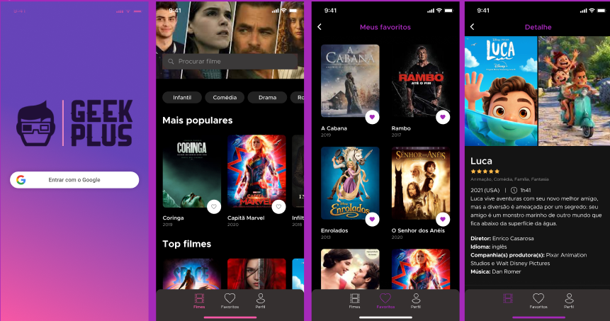

<p align="center">
   
</p>


<h2 align="center">Tópicos 📋</h2>

   <p>
   

   - [Tecnologias 📖](#tecnologias-)
   - [Sobre 📖](#sobre-)
   - [Como Usar 🤔](#como-usar-)

   </p>

---
<h2 align="center">Tecnologias 📖</h2>
   
- GetX
- FireBase
- Google Sign in
- API The Movie DB


<h2 align="center">Sobre 📖</h2>
   eek Plus is a project created during the Academia do Flutter's DartWeek 4 event with the Flutter.
<p>
   O projeto Geek Plus foi desenvolvido na DartWeek 4. Um evento incrível que trouxe um projeto traz projetos inéditos e desafiador,  onde foi possivel  aprender um pouco de como funciona o flutter com o Getx; além de mostrar também como consumir uma API real. <br>
   O Geek Plus se trata de um app mobile feito em Flutter 💙 para Gerenciamento de filmes, contendo recursos como o login,busca de filmes, detalhes de filmes e salvar o seu filme favorito. <br>
</p>


<h2 align="center">Como Usar 🤔</h2>

   ```
   - Clone esse repositório:
   $ git clone git@github.com:WellingtonFreitas/app-geek-plus.git

   - Entre no diretório:
   $ cd app_geek_plus
   - Instale as dependências:
   $ flutter pub get

   - Inicie o app: 
   $ flutter run
   ```


### Autor
---

<a href="https://github.com/WellingtonFreitas">
 
 <br />
 <sub><b>Wellington Freitas</b></sub></a> <a> 


Entre em contato!
</br>
[](https://www.linkedin.com/in/wellington-freitas-43624283/) [](mailto:wellington.m.de.freitas@gmail.com)
